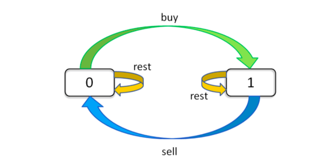

# 题目

[买卖股票的最佳时机](https://leetcode-cn.com/problems/best-time-to-buy-and-sell-stock/solution/)

[买卖股票的最佳时机 II](https://leetcode-cn.com/problems/best-time-to-buy-and-sell-stock-ii/)

[买卖股票的最佳时机 III](https://leetcode-cn.com/problems/best-time-to-buy-and-sell-stock-iii/)

[买卖股票的最佳时机 IV](https://leetcode-cn.com/problems/best-time-to-buy-and-sell-stock-iv/)

[最佳买卖股票时机含冷冻期](https://leetcode-cn.com/problems/best-time-to-buy-and-sell-stock-with-cooldown/)

[买卖股票的最佳时机含手续费](https://leetcode-cn.com/problems/best-time-to-buy-and-sell-stock-with-transaction-fee/)

[参考](https://leetcode-cn.com/problems/best-time-to-buy-and-sell-stock/solution/yi-ge-fang-fa-tuan-mie-6-dao-gu-piao-wen-ti-by-l-3/)


- 第一题是只进行一次交易，相当于 k = 1；
- 第二题是不限交易次数，相当于 k = +infinity（正无穷）；
- 第三题是只进行 2 次交易，相当于 k = 2；
- 剩下两道也是不限次数，但是加了交易「冷冻期」和「手续费」的额外条件，其实就是第二题的变种，都很容易处理。


# 基本思想

> 利用「状态」进行穷举。我们具体到每一天，看看总共有几种可能的「状态」，再找出每个「状态」对应的「选择」。
>
> 我们要穷举所有「状态」，穷举的目的是根据对应的「选择」更新状态。听起来抽象，你只要记住「状态」和「选择」两个词就行


```java
for 状态1 in 状态1的所有取值：
    for 状态2 in 状态2的所有取值：
        for ...
            dp[状态1][状态2][...] = 择优(选择1，选择2...)
```

> 每天都有三种「选择」：买入、卖出、无操作，我们用 buy, sell, rest 表示这三种选择。
>但问题是，并不是每天都可以任意选择这三种选择的，

- 因为 sell 必须在 buy 之后，
- buy 必须在 sell 之后
- 那么 rest 操作还应该分两种状态
    - 一种是 buy 之后的 rest（持有了股票）
    - 一种是 sell 之后的 rest（没有持有股票）
    - 而且别忘了，我们还有交易次数 k 的限制，就是说你 buy 还只能在 k > 0 的前提下操作。

> 现在的目的只是穷举，你有再多的状态，老夫要做的就是一把梭全部列举出来。\
>
>这个问题的「状态」有三个

- 第一个是天数
- 第二个是允许交易的最大次数
- 第三个是当前的持有状态（即之前说的 rest 的状态，我们不妨用 1 表示持有，0 表示没有持有）

> 然后我们用一个三维数组就可以装下这几种状态的全部组合：

- `dp[3][2][1]` 的含义就是：今天是第三天，我现在手上持有着股票，至今最多进行 2 次交易
- `dp[2][3][0]` 的含义：今天是第二天，我现在手上没有持有股票，至今最多进行 3 次交易
  
> 最终答案是 `dp[n - 1][K][0]`，即最后一天，最多允许 K 次交易，最多获得多少利润。
>
>读者可能问为什么不是 dp[n - 1][K][1]？因为 [1] 代表手上还持有股票，[0] 表示手上的股票已经卖出去了，很显然后者得到的利润一定大于前者


```java
dp[i][k][0 or 1]
0 <= i <= n-1, 1 <= k <= K
n 为天数，大 K 为最多交易数
此问题共 n × K × 2 种状态，全部穷举就能搞定。

for 0 <= i < n:
    for 1 <= k <= K:
        for s in {0, 1}:
            dp[i][k][s] = max(buy, sell, rest)
```



> dp[i][k][k] : 状态转移

```
dp[i][k][0] = max(dp[i-1][k][0], dp[i-1][k][1] + prices[i])
              max(   选择 rest  ,             选择 sell      )

解释：今天我没有持有股票，有两种可能：
要么是我昨天就没有持有，然后今天选择 rest，所以我今天还是没有持有；
要么是我昨天持有股票，但是今天我 sell 了，所以我今天没有持有股票了。

dp[i][k][1] = max(dp[i-1][k][1], dp[i-1][k-1][0] - prices[i])
              max(   选择 rest  ,           选择 buy         )

解释：今天我持有着股票，有两种可能：
要么我昨天就持有着股票，然后今天选择 rest，所以我今天还持有着股票；
要么我昨天本没有持有，但今天我选择 buy，所以今天我就持有股票了。

如果 buy，就要从利润中减去 prices[i]，如果 sell，就要给利润增加 prices[i]。
今天的最大利润就是这两种可能选择中较大的那个。
而且注意 k 的限制，`我们在选择 buy 的时候，把 k 减小了 1`，很好理解吧，当然你也可以在 sell 的时候减 1，一样的。


```

> base case

```
dp[-1][k][0] = 0
解释：因为 i 是从 0 开始的，所以 i = -1 意味着还没有开始，这时候的利润当然是 0 。
dp[-1][k][1] = -infinity
解释：还没开始的时候，是不可能持有股票的，用负无穷表示这种不可能。
dp[i][0][0] = 0
解释：因为 k 是从 1 开始的，所以 k = 0 意味着根本不允许交易，这时候利润当然是 0 。
dp[i][0][1] = -infinity
解释：不允许交易的情况下，是不可能持有股票的，用负无穷表示这种不可能。

```

> 总结

```
base case：
dp[-1][k][0] =  0
dp[-1][k][1] = -infinity // 负无穷表示不可能

# 一个面
dp[i][0][0] = 0
dp[i][0][1] = -infinity

状态转移方程：
dp[i][k][0] = max(dp[i-1][k][0], dp[i-1][k][1] + prices[i])
dp[i][k][1] = max(dp[i-1][k][1], dp[i-1][k-1][0] - prices[i])

```
