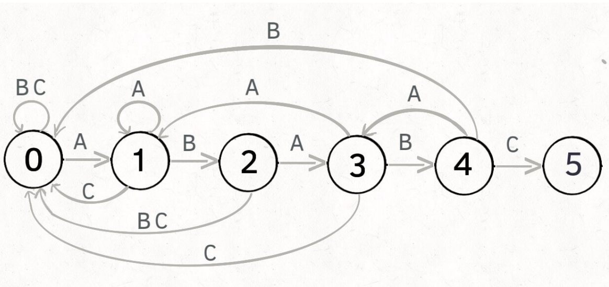

> 模式串 pat 模式串长 m  模式数组 dp[] 只与 pat有关 与text 无关
>
>文本串 text 文本串长度 n


> pat ： ABABC



```
dp[j][c] = next
0 <= j < M，代表当前的状态
0 <= c < 256，代表遇到的字符（ASCII 码）
0 <= next <= M，代表下⼀个状态

dp[4]['A'] = 3 表⽰：
当前是状态 4，如果遇到字符 A，
pat 应该转移到状态 3

dp[1]['B'] = 2 表⽰：
当前是状态 1，如果遇到字符 B，
pat 应该转移到状态 2
```
