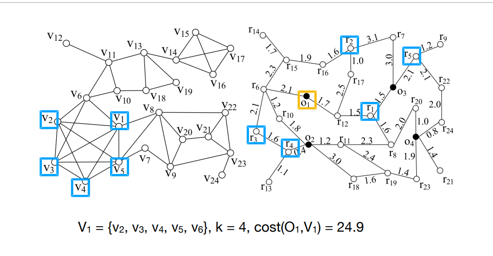

# 赚钱

- 疫情-口罩
- 校招-？
- 倒买倒卖

# 面试要点

> 提前准备自我介绍(针对公司)

> 简历面，要对简历充满信心(一定要面向简历构建面试体系)

> 用自己的知识网络引导面试官；擅长的问题多说所引导，拖时间

> 最好每个点深入底层（源码、举一反三、体系 ）

# 面试提问点

- 基础知识
- 组件代表性的流程、核心原理
- 场景题+知识运用
- 项目+知识运用

> 基本不会对一些固定的细节提问，不要把时间浪费在这些固定的细节上。要么就是深挖底层原理

# Java基础、算法、SQL、大数据
> 集合、JVM、多线程、IO

> 回溯(递归)、滑动窗口、双指针、栈、链表、树、动态规划、单调栈、并查集

> 窗口函数、子查询、关联查询

> Hadoop、Hive、Spark、Kafka、Zookeeper、Flume

# 项目

## 工作经验

> 略

## 个人博客

> 略

## 地图数据分析项目

### 背景

> 基于地理信息(坐标)的社交网络：寻找在社交⽹络图中紧密连接，
>在地理位置上邻近的社区。组织线下活动，例如聚会、PokemonGo游戏、桌游、体育活动

- 找一个社区要求：
- 要求所有用户在一个范围内(矩形、圆型)
- 要求任意两个用户之间的距离≤R
- 要求所有用户到一个集合地点的距离 <= R
- 不限制社区⼤⼩，通常是⼈数越多越好，找满⾜限制条件的最⼤的社区
- 限制⼈数，找符合限制条件，且⼈数为c的社区
- 使⽤直线距离，⽽不是道路距离
- Social:限定社区⼤⼩，采⽤k-core模型，最接近实际应⽤
- Spatial:使⽤路⽹，要求有⼀个集合地点，要求距离之和最⼩
- ⽤户V1想找4位⼩伙伴玩桌游，有O1，O2，O3，O4， 4个桌游吧，他希望⼤家
  尽可能熟悉，且每个⼈到桌游吧的路程 ≤ 7.0
  
 >  k-Core算法是一种子图挖掘算法，用于寻找一个图中符合指定核心度的顶点的集合，即要求每个顶点至少与该子图中的其他k个顶点相关联。如图1所示，分别对应1-Core，2-Core和3-Core，任何一个图，在不包含孤立顶点的情况下，都是1-Core的

> 总结：找一个社区； 满足：
- 社区内所有用户在一个范围内，限制⼈数
- 社区内任意用户距离≤R，所有用户到一个集合地点的距离 <= R
- 要求有⼀个集合地点，要求距离之和最⼩

### 坐标信息分析

> 根据位置划分坐标数据，验证算法的正确性

> 划分方式：画圆，画矩形。分类坐标

### 地点信息搜索

> 搜索指定范围内的位置信息（饭店、桌游吧）

### 总结

- 给定一个图(坐标)
- 给定一个区域 （参与）
- 给定一个集合地点 (参与)
- 找到一个社区 (k-core)

> 采用 Spark 并行计算加速（k-core）

## Neo4j

> 建模、存储、查询

> 计算，调用算法处理图数据，结果保存到数据库

> 可视化展示，neo4j 自带、vue(neovjs)

### 待深入

- 图数据库比较
- neo4j 底层结构

## 数仓项目

> 吃透笔记，熟练于胸
> 待完成

